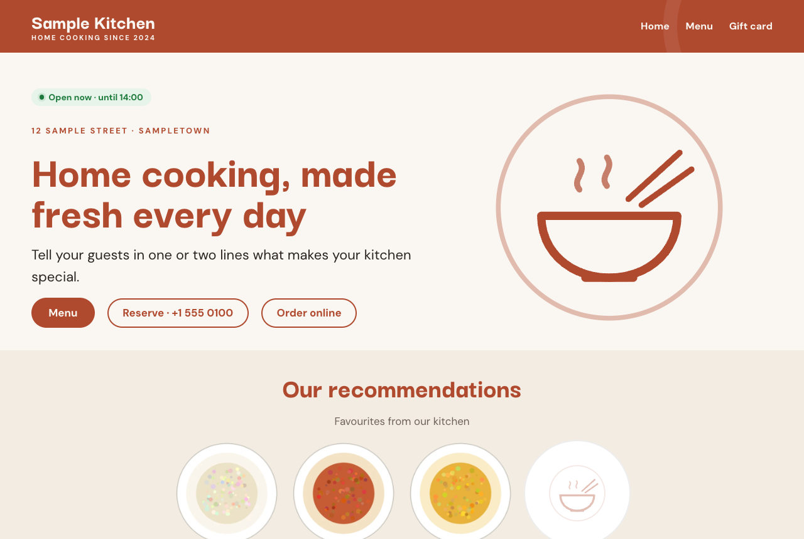
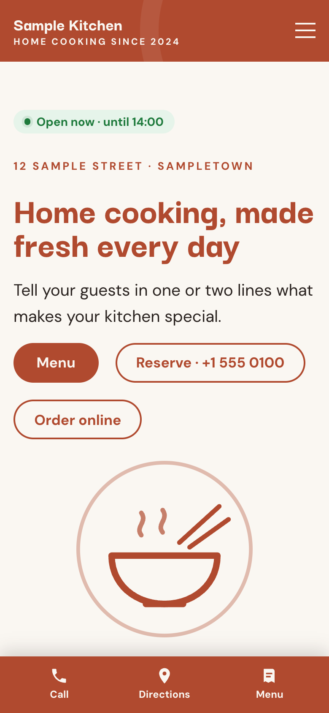

# MenuDash Theme

A restaurant website theme for WordPress, made for the **[MenuDash](https://github.com/yingshiuan/menudash)** plugin.

MenuDash holds everything the restaurant keeps up to date: the menu, today's specials, opening hours and holidays, gift cards and the restaurant's details (address, phone, delivery link and times, social links). This theme shows all of it in a warm, simple design, so the owner never edits the same phone number in two places.

 

## What's on the home page

| Section | Where its content comes from |
|---|---|
| Welcome: headline, "Open now · until 22:00", buttons *Menu · Reserve · Order online* | the text in the editor; the badge, phone and order link from MenuDash |
| Our recommendations | the dishes marked **Recommended** in the menu, with their photos |
| What guests say | a quote you type in the editor |
| About us | your text, and the Instagram button from MenuDash |
| Gift card | shows by itself while MenuDash takes gift card orders |
| Visit us / Delivery, with a map | address, phone, getting here, delivery link and ordering times from MenuDash; the map loads only after a click |
| Footer | address, social icons, getting here, opening hours, "© Company · Privacy" |

On phones a bar at the bottom offers **Call · Directions · Menu**. The menu page (any page with `[menudash]`) gets a wide layout by itself, with today's specials above the menu.

## Install

1. Install and activate **MenuDash** first (see its [releases](https://github.com/yingshiuan/menudash/releases)).
2. Download `menudash-theme.zip` from this repository's [releases](https://github.com/yingshiuan/menudash-theme/releases), then *Appearance → Themes → Add New Theme → Upload Theme*, and activate it.
3. On activation the theme makes a **Home** page from its sections and sets it as the front page (a site with a front page already keeps it; the sections are then in the block inserter under *Restaurant (MenuDash)*).
4. Fill in **MenuDash → Restaurant** (address, phone, delivery …) and **MenuDash → Hours & holidays**, and upload your menu.
5. Add your logo under *Appearance → Editor* (the header shows the site title until then), and build the top menu under *Appearance → Editor → Navigation*.

Requires WordPress 6.5+ and PHP 7.4+.

## Editing

It's a block theme: *Appearance → Editor* for the header, footer and templates, *Styles* for colours and fonts (three colour sets included: the default terracotta, *Olive* and *Midnight*), and *Pages → Home* for the home page's texts.

Parts with a thin dashed outline in the editor come from MenuDash (address, phone, buttons, delivery, map, the footer's contact lines). They are drawn fresh on every page view, so saving a page never freezes old details into it: change them in MenuDash, not in the editor.

## Languages

The theme is written in English and includes German (`de_DE`, and `de_CH` with "ss"). WordPress picks the language from *Settings → General → Site Language*. To add another, translate `menudash-theme/languages/menudash-theme.pot` (e.g. with Poedit) and save the files as `languages/<locale>.po` and `.mo`.

## For developers

```sh
dev/serve.sh              # a local WordPress with MenuDash and its sample menu: http://127.0.0.1:9402
dev/serve.sh 9403 de      # the same in German
dev/build-zip.sh          # dist/menudash-theme.zip
```

`serve.sh` downloads MenuDash into `dev/.cache` the first time (or uses `MENUDASH_DIR`). It needs Node.js; WordPress runs in [WordPress Playground](https://wordpress.org/playground/).

The theme's MenuDash blocks are in `menudash-theme/inc/blocks.php` (`menudash-theme/contact`, `buttons`, `delivery`, `map`, `picks`, `giftcard` …). They read MenuDash with `mdash_detail()`, `mdash_hours()` and the menu data, and print nothing without MenuDash.

## Licence

GPL-2.0-or-later, like WordPress. The fonts, DM Sans and Darker Grotesque, are under the SIL Open Font License (see `menudash-theme/assets/fonts`).
